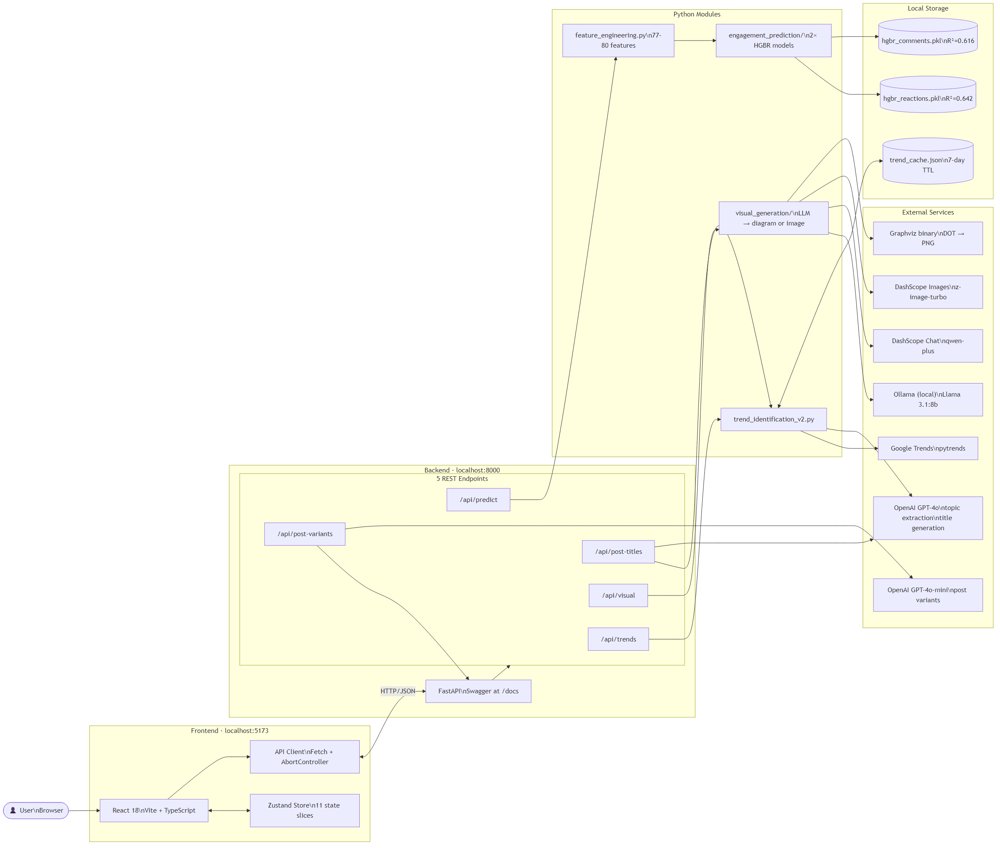
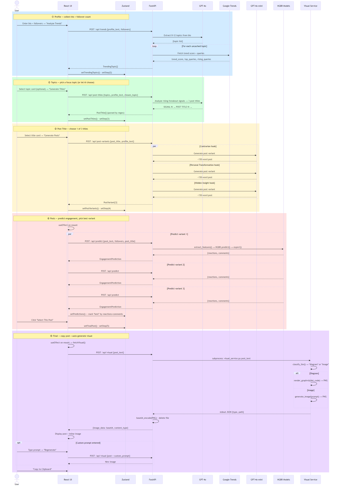
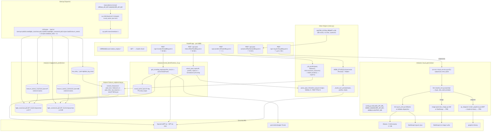
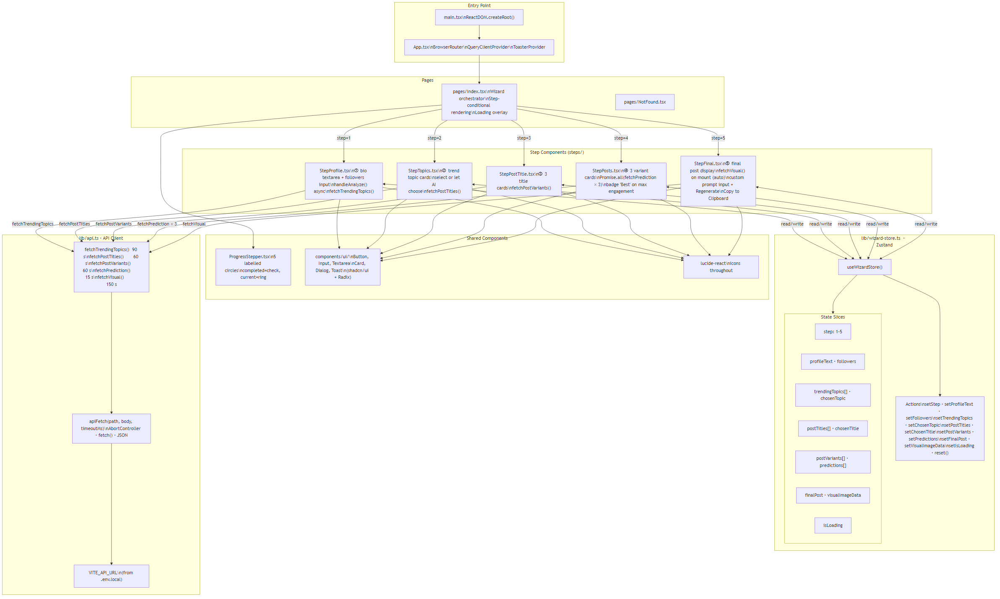
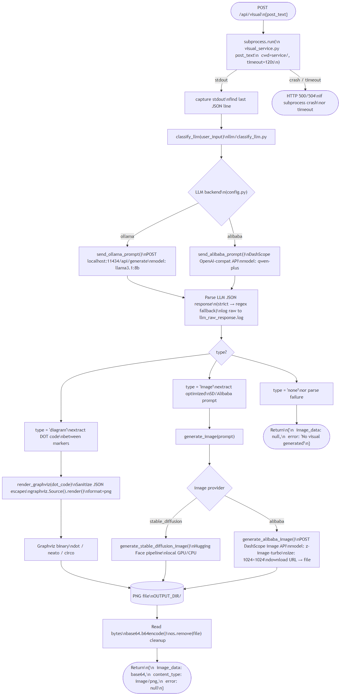
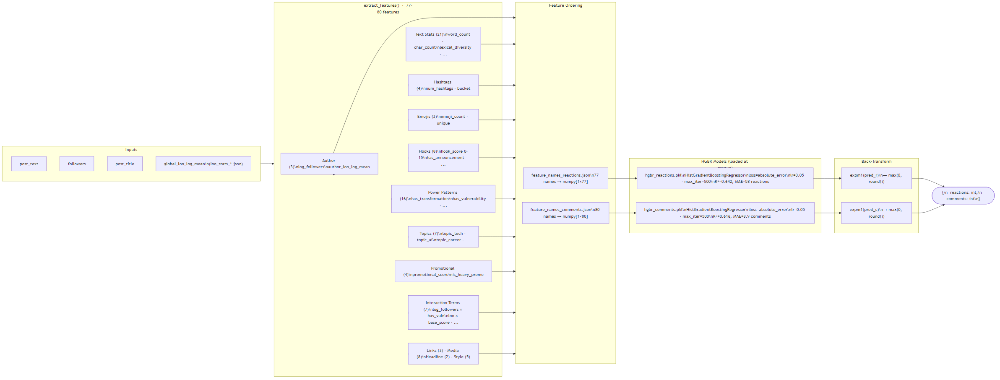
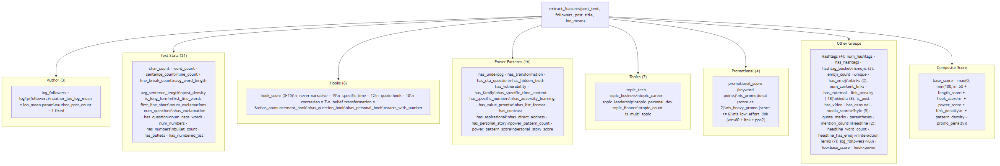
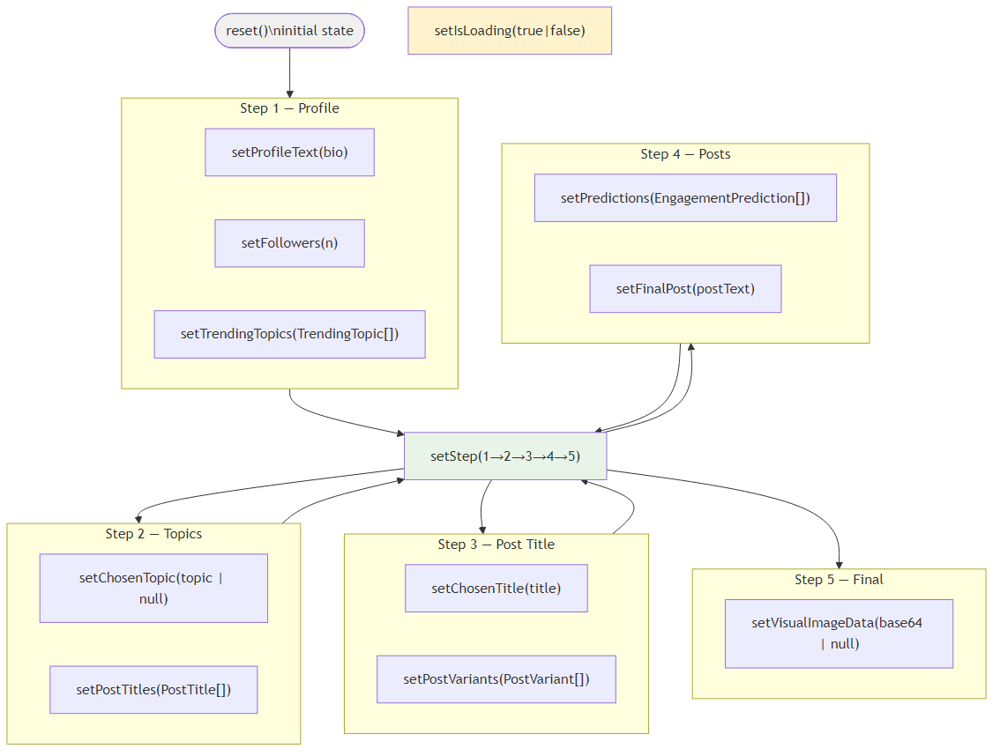
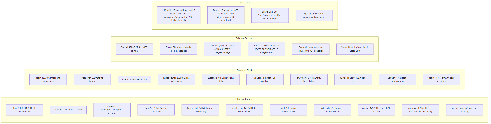
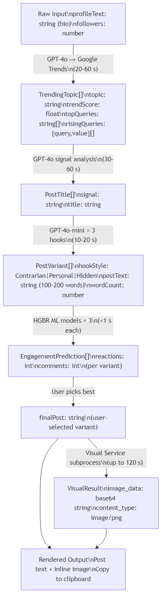

# TrendPilot — Architecture Reference

> Generated diagrams covering system overview, user flow, backend, frontend, pipelines, and tech stack.
> PNG images are pre-rendered from Mermaid source files in [diagrams/](diagrams/).

---

## Table of Contents

1. [System Overview](#1-system-overview)
2. [User Flow — 5-Step Wizard](#2-user-flow--5-step-wizard)
3. [Backend Architecture](#3-backend-architecture)
4. [Frontend Architecture](#4-frontend-architecture)
5. [Visual Generation Pipeline](#5-visual-generation-pipeline)
6. [Engagement Prediction Pipeline](#6-engagement-prediction-pipeline)
7. [Feature Engineering](#7-feature-engineering)
8. [State Management](#8-state-management)
9. [Technology Stack](#9-technology-stack)
10. [End-to-End Data Flow](#10-end-to-end-data-flow)
11. [API Contracts](#11-api-contracts)
12. [File Structure](#12-file-structure)

---

## 1. System Overview

High-level view of all layers: browser → frontend → backend → modules → external services.



---

## 2. User Flow — 5-Step Wizard

Complete sequence from first input to final post + visual.



---

## 3. Backend Architecture

Internal structure of the FastAPI backend — startup, routes, helpers, and module wiring.



---

## 4. Frontend Architecture

React component tree, Zustand store structure, and API client wiring.



---

## 5. Visual Generation Pipeline

Detailed flow inside `visual_generation/` — from post text to base64-encoded image.



---

## 6. Engagement Prediction Pipeline

From raw post text to predicted reactions and comments.



---

## 7. Feature Engineering

The 77–80 features extracted by `helpers/feature_engineering.py`.



---

## 8. State Management

How data flows through the Zustand store across all 5 steps.



---

## 9. Technology Stack



---

## 10. End-to-End Data Flow

Data transformations at each stage, from raw user text to final LinkedIn post.



---

## 11. API Contracts

### All Endpoints

| Method | Path | Request Body | Response | Timeout |
|--------|------|--------------|----------|---------|
| `GET` | `/` | — | `{status, service}` | — |
| `POST` | `/api/trends` | `{profile_text, followers}` | `TrendingTopic[]` | 90 s |
| `POST` | `/api/post-titles` | `{trending_topics[], profile_text, chosen_topic?}` | `PostTitle[]` | 60 s |
| `POST` | `/api/post-variants` | `{post_title, profile_text}` | `PostVariant[]` | 60 s |
| `POST` | `/api/predict` | `{post_text, followers, post_title}` | `{reactions, comments}` | 15 s |
| `POST` | `/api/visual` | `{post_text}` | `VisualResult` | 150 s |

### Pydantic Schemas (Backend)

```
TrendsRequest        { profile_text: str, followers: int = 1000 }
PostTitlesRequest    { trending_topics: list[TrendingTopicIn], profile_text: str, chosen_topic: str|None }
PostVariantsRequest  { post_title: str, profile_text: str }
PredictRequest       { post_text: str, followers: int, post_title: str = "" }
VisualRequest        { post_text: str }
```

### TypeScript Interfaces (Frontend)

```typescript
TrendingTopic        { topic, trendScore, topQueries[], risingQueries[{query,value}] }
PostTitle            { signal, title }
PostVariant          { hookStyle, postText, wordCount }
EngagementPrediction { reactions, comments }
VisualResult         { image_data: string|null, content_type: string, error: string|null }
```

---

## 12. File Structure

```
Capstone/
├── ARCHITECTURE.md                          ← this file
├── RUNNING.md                               ← how to run
├── PLAN.md                                  ← implementation plan
│
├── backend/
│   ├── main.py                              5 routes + startup + helpers
│   ├── requirements.txt
│   ├── .env                                 template (committed)
│   ├── .env.secrets                         real keys (gitignored)
│   ├── .gitignore
│   ├── helpers/
│   │   ├── __init__.py
│   │   └── feature_engineering.py           77–80 feature extractor
│   └── modules/
│       ├── trend_identification_v2.py       Google Trends + GPT-4o
│       ├── engagement_prediction/
│       │   ├── hgbr_reactions.pkl           reactions model
│       │   ├── hgbr_comments.pkl            comments model
│       │   ├── feature_names_reactions.json 77 ordered feature names
│       │   ├── feature_names_comments.json  80 ordered feature names
│       │   ├── loo_stats_reactions.json     author baseline stats
│       │   ├── loo_stats_comments.json
│       │   └── metadata.json               hyperparameters + metrics
│       └── visual_generation/
│           ├── config.py                    LLM + image API settings
│           ├── service/
│           │   └── visual_service.py        subprocess CLI entry point
│           ├── llm/
│           │   ├── classify_llm.py          LLM classification logic
│           │   └── query_llm.py             Ollama / Alibaba dispatcher
│           ├── gv_diagram/
│           │   └── render_graphviz.py       DOT → PNG renderer
│           └── image/
│               └── generate_image.py        SD / Alibaba image generator
│
├── trendpilot/
│   ├── package.json
│   ├── vite.config.ts
│   ├── tailwind.config.ts
│   ├── .env.local                           VITE_API_URL=http://localhost:8000
│   └── src/
│       ├── main.tsx                         ReactDOM entry
│       ├── App.tsx                          providers + router
│       ├── pages/
│       │   ├── Index.tsx                    5-step wizard page
│       │   └── NotFound.tsx
│       ├── components/
│       │   ├── ProgressStepper.tsx          step indicator
│       │   ├── steps/
│       │   │   ├── StepProfile.tsx          step 1
│       │   │   ├── StepTopics.tsx           step 2
│       │   │   ├── StepPostTitle.tsx        step 3
│       │   │   ├── StepPosts.tsx            step 4
│       │   │   └── StepFinal.tsx            step 5
│       │   └── ui/                          shadcn/ui components
│       ├── lib/
│       │   ├── api.ts                       API client + type exports
│       │   └── wizard-store.ts              Zustand store
│       └── hooks/
│           └── use-mobile.tsx
│
└── capstone_trend_pilot/                    original Streamlit app (unchanged)
    └── streamlit/
        └── app.py                           1083-line monolith (source of truth)
```
